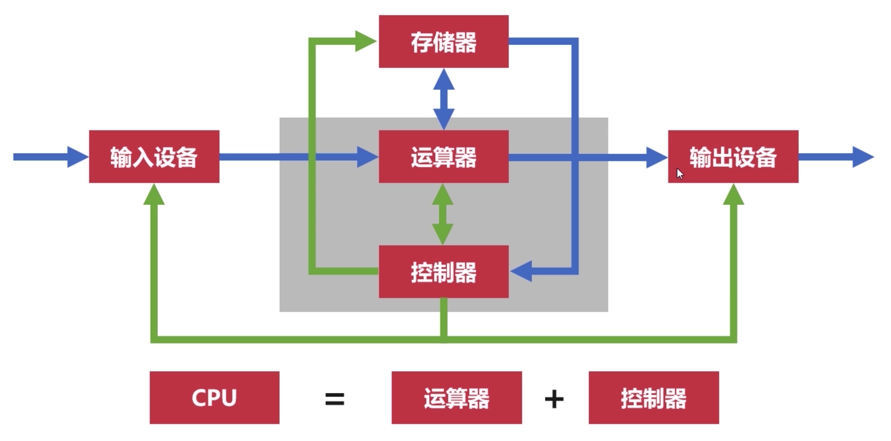
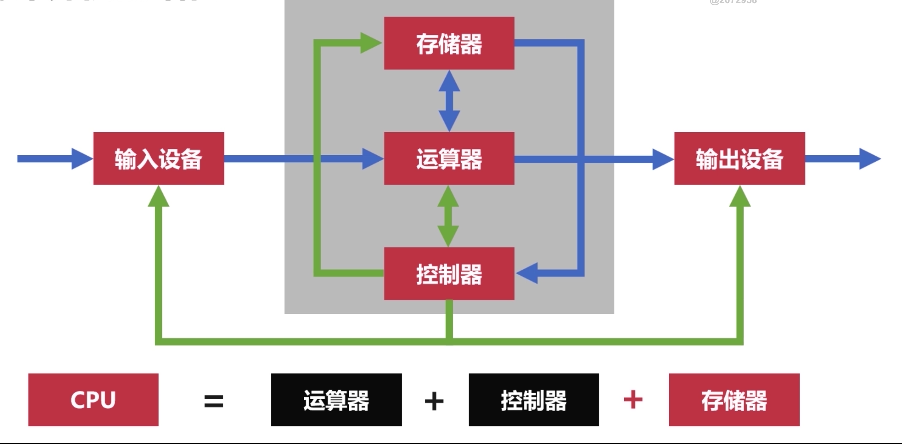

## 冯诺依曼体系

将 `程序指令`和 `数据`一起存储的的计算机设计概念结构

* 早期计算机只含有固定用途的程序，改变程序需要重新设计电路
* 冯诺依曼提出，把程序存储起来，并设计通用电路

### 结构

由存储器，控制器，运算器，输入设备，输出设备5个部分组成

现代计算机都是冯诺依曼机

#### 冯诺依曼瓶颈

CPU和存储器速率之间的问题无法调和

* CPU的速度大于存储速度
* CPU空转，等待数据传输

## 现代计算机结构

基于冯诺依曼进行修改

解决CPU与存储设备间的性能差异问题

> 下图的存储器指CPU寄存器和内存等高速设备

